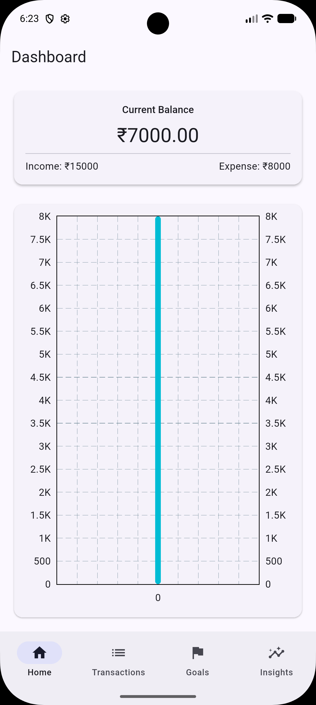
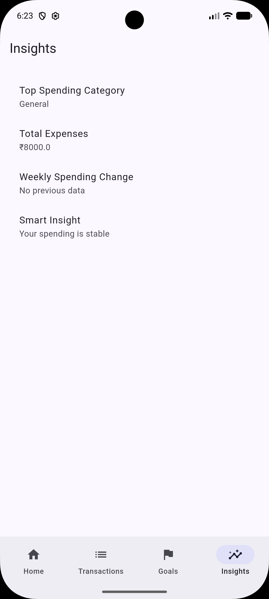
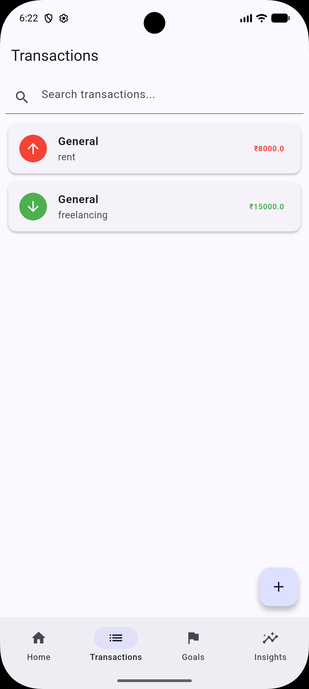

# FinTrackr – Personal Finance Companion

## Overview
FinTrackr is a lightweight personal finance mobile application built using Flutter.  
It helps users track daily transactions, monitor spending patterns, and achieve savings goals.

---

## Features
- Dashboard with balance + visual insights
- Transaction management (Add, Edit, Delete)
- Search and filtering
- Savings goal tracking
- Insights based on real user data
- Offline-first using Hive database

---

## Tech Stack
- Flutter
- Riverpod (State Management)
- Hive (Local Storage)
- fl_chart (Visualization)

---

## COMPLETE FILE STRUCTURE
```bash
lib/
│
├── core/
│   ├── services/
│   │   ├── hive_service.dart
│
├── data/
│   ├── models/
│   │   ├── transaction_model.dart
│   │   ├── goal_model.dart
│   │
│   ├── repositories/
│   │   ├── transaction_repository.dart
│   │   ├── goal_repository.dart
│
├── providers/
│   ├── transaction_provider.dart
│   ├── dashboard_provider.dart
│   ├── goal_provider.dart
│
├── features/
│
│   ├── dashboard/
│   │   ├── dashboard_screen.dart
│   │   ├── widgets/
│   │       ├── balance_card.dart
│   │       ├── expense_chart.dart
│
│   ├── transactions/
│   │   ├── transaction_list_screen.dart
│   │   ├── add_edit_transaction_screen.dart
│   │   ├── widgets/
│   │       ├── transaction_tile.dart
│   │       ├── filter_bar.dart
│
│   ├── goals/
│   │   ├── goal_screen.dart
│
│   ├── insights/
│   │   ├── insights_screen.dart
│   │   ├── widgets/
│   │       ├── category_chart.dart
│
│   ├── shared/
│   │   ├── widgets/
│   │       ├── custom_textfield.dart
│   │       ├── custom_button.dart
│   │       ├── empty_state.dart
│
├── main.dart
└── pubspec.yaml
```

---

## Screenshots




---

## Architecture
Feature-first architecture with clear separation:

- **Core** → constants, utilities, services
- **Data** → models + repositories
- **Providers** → state management layer
- **Features** → UI screens + widgets
- **Shared** → reusable UI components

---

## Key Design Decisions

- Used **Hive** for fast local storage and offline-first behavior
- Used **Riverpod** for scalable and testable state management
- Applied **feature-based architecture** for modularity
- Separated UI from business logic for maintainability

---

## App Flow

1. Dashboard → financial overview
2. Transactions → CRUD operations
3. Goals → savings tracking
4. Insights → spending analysis

---

## Assumptions

- Single user app (no authentication)
- Offline-first design
- Data stored locally

---

## How to Run

```bash
flutter pub get
flutter packages pub run build_runner build --delete-conflicting-outputs
flutter run